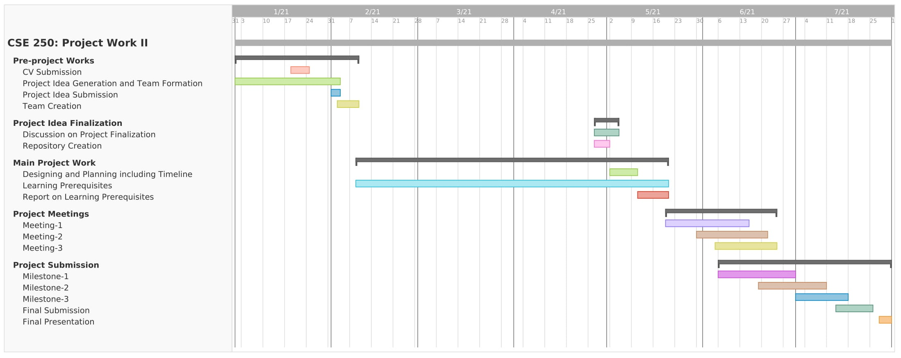

Project Timelines
=================

SL|Task|Deadline|Submission Platform
-:|----|:------:|:-----------------:
1|Curriculum Vitae| January 24, 2021|Google Classroom
2|Team Formation with Project Idea| ~~February 01, 2021~~   <strong>February 03, 2021 </strong>|Google Classroom
3|Project Finalization| ~~February 03, 2021~~   <strong>April 27, 2021</strong>| Online
4|Team & Repo Creation in GitHub| ~~February 04, 2021~~   <strong>February 09, 2021</strong>| GitHub & Online
5|Submission of Project Plan (what would be submitted on milestones) & Timeline| ~~February 12, 2021~~   <strong>May 10, 2021</strong>| GitHub Repository
9|Report on Learning Pre-requisities | ~~February 15, 2021~~   <strong>May 20, 2021</strong>| ~~Google Classroom~~   GitHub Repository
10|Final Presentation| ~~May 24 & 25, 2021~~ | Online

Milestones
----------
SL| % of Work Completion| Date|Submission Platform
-:|:-------------------:|:---:|:-----------------:
6| 40% | ~~March 25, 2021~~ | GitHub Repository
7| 70% | ~~April 15, 2021~~ | GitHub Repository
8| 100%| ~~May 23, 2021~~ | GitHub Repository

Expected Timeline
-----------------

Course Info
-----------
- [Google Classroom](https://classroom.google.com/u/3/c/MjU2NTY4OTEzMTI3)
- [GitHub Classroom](https://classroom.github.com/classrooms/77567207-cse-250-project-work-ii-for-session-2018-19)

Project Team Information
========================

Team # | Team Name| Reg. # | Name| Reg. # | Name| Project Title|
--:|:----:|:------:|:----|:------:|:----|:---------------------|
1|Team_Solo|2017331027|Al-Masum||| Smart Bachelor
2|Extractor.zip|2018331037|Kaifa Tabassum|2018331046|Zhalok Rahman| Resource Sharing
3|Team  we_apologise|2018331086|Kongka Rani Mozumder|2018331068|Moksedur Rahman Sohan| Student Forum
4|Project lover |2018331073|Riddhiman Swanan Debnath|2017331104|Imtiaz Kabir Iftu| Hall Management System - Android
5|Team twain|2018331113|Muhit Mahmud|2018331047|Nazmun Nahar Tui| Appointment Scheduler
6|DeenDev|2018331121|Fahim Ahmed|2018331019|Naimul Islam| Islamic App - Android
7|The Binary Star|2018331003|Shahrab Khan Sami|2018331118|Golam Mostofa Naeem| Islamic App - Web
8|Sneaky Stars|2018331072|Tahsina Bintay Azam|2018331022|Nowshin Alam Owishi| Library Management System
9|Code Clan|2018331088|MD. Rabiul Islam||| Idea Sharing Zone: Sharing Idea and Constructing Group for Projects
10|Team Rafi and Dipto |2018331034|Pritam Sarker Dipto|2018331035|Abrar Zahin Rafi| E-voting
11|Team_Bona_Fide|2018331055|Md. Abdul Kadir|2018331059|Sabiha Jahan Mim| Medi Discover: Finding nearest doctor and pharmacy, alarming about taking medicine
12|The Apostrophe|2018331030|Shrestha Datta|2018331062|MD. SUMON MIAH| To-Let
13|Epic_Dreamer|2018331126|Tithi Saha|2018331024|Md. Fuadul Islam| Exam System Extension
14|Sustaina|2018331095|Mirza Nihal Baig|2018331093|Nahian Beente Firuj| Linked List Visualizer
15|Drishub|2018331049|Ananna Datta Dristy|2018331051|Tanhab Hossain| Programming Community
16|Team ARCANE|2018331043|Mahnur Rahman Mahin|2018331117|Ahmed Iftekher Rais| Classroom Management - Web
17|Team Marshmallow|2018331081|MD.ATAULLHA|2018331045|Soumik Paul Jisun| Freshman Utilities
18|Project CSE-250|2018331057|Jakir Hasan||| Viva Scheduler
19|Revengers|2018331119|Alfeh Sani|2018331077|Omar sultan| Contest Update
20|Storm£Breaker|2018331052|Hrithik Majumdar Shibu|2018331056|Ashraful Islam| Dictionary Traversal - Web 1
21|Team_Cofused|2018331042|MD. Tariful Islam|2018331028|Kazi Md Arif Shahriar| Dictionary Traversal - Android
22|Seekers |2018331004|Ameya Debnath|2018331050|Raisa Fairooz| Tuition Media
23|mt19937|2018331085|Kawchar Husain|2018331053|Shaikat Hosen| Benchmarking through Quiz App
24|VisionaryProvider|2018331082|Md Adith Mollah||| Recursion Visualizer
25|Poltergeist|2018331103|Md. Sakil Sazzad Joy|2018331107|Rony Hajong| Hall Management System - Web
26|Warriors|2017331090|MD.SHAKIL|2017331100|Ashikur Rahman| Calorie Analysis
27|The Warriors|2018331044|Siam Jahan|2018331048|Suraiya Akter Eva| E-commerce Site
28|Bazinga!|2018331027|Bipul Karmokar||| Academic Exchange
29|TEAM-SLACK|2018331014|Md Saiful islam|2018331032|Shafaet ullah| Donation App
30|Paradox|2018331115|Md Mizbah Uddin Junaed|2018331111|Redwanur Rahman Akanda| SUST Interact
31|return pass_mark|2018331125|Kabir ahmed|2018331033|Mehedi hasan rabby| Task Scheduler
32|Team_noob|2018331010|Tufail Ahmed|2018331100|Shanur Milon| Mess Meal Management
33|A_Team_Has_No_Name|2018331071|Nishat Rahman|2018331087|Nafis Fuad Abir| GRE Master
34|Team Strategy|2018331065|Debapriya dhar|2018331097|Aisha Hayder Chowdhury| Book Rent
35|Goodwill|2017331094|Mahmodul Hasan Sakib||| Quiz App
36|Developer_Duo|2018331029|Ishrat Jahan|2018331011|Amir Hamza| Medical Center Automation
37|Team Mita|2018331078|Md Hasibul Islam Shanto|2018331084|S M Al Hasib| SUST Portal
38|team πrates|2018331083|Mushfiqur Rahman|2018331123|Mahbubul Hasan| Programming Mentor
39|Ninja Developers |2017331075|Md. Mustaqur Rahman|2017331088|Roman Raihan| Result Visualization
40|Explorer|2018331098|Mahdi Murshed Patwari ||| CR Helper
41|Keyboard Warrior|2018331084|MD. Toufiqul Islam Fahim|2018331120|Abdul Wadud Shakib| Daily Essential
42|OneZero Noobs|2018331040|Antar Roy|2018331012|Faridul Reza Sagor| Exam Management
43|SaSo et al|2016331020|Sadekujjaman|2016331004|MD. Shahidul Islam| Project Distribution
44|OldAcquaintances|2017331010|M. Ebrahim Sazin|2017331013|Navid Ishriyaq Amin| Viva Management
45|TEAM 00|2018331070|NURUN ISLAM NILOY||| Classroom
46|Yellow Flash|2018331036|Nasrullah Sami|2018331064|Mahir Mosleh| CP Gamify
47|CB|2017331084|jamil mahmood|2017331048|Ezaz Ahmed Miraz| Blood Management
48|Team JOJO|2018331060|Md. Tangid Khan|2018331124|Fazla Rabby Rady| Dictionary Traversal - Web 2
49|Team_bibliophile|2018331018|Tanusree Saha|2018331105|Mala Jhora| Cafe Management
50|Falcons|2017331076|Pritam Das|2017331068|Zakir Hossain| Letter Automation
51|Headless Monstar|2018331110|Abu Anash Siddiki Badhon|2018331114|Tanvir Mahmud| Recipe Hunter
52|Tehetetlen|2018331106|Fatima Nuzhat|2018331008|Samia Preity| Audible Textbook
53|Team আইলসা|2018331090|Ahad Mahjabin Jannat|2018331122|Fahmida Akter| Couple Search
54|Betelgeuse|2018331061|Sujoy Kumar Ray|2018331041|Aahsanul Azim| Notice Board
55|Ganymede|2018331069|Oishik Biswas|2017331035|MD.AZHARUL KARIM CHOWDHURY ANIK| Exam System - Android
56|Akash|2017331058|Md. Kaef Khan|2017331067|Shah Ashfaqur Rahman| Event Management
57|ArektaTeam|2018331002|Mehedi Hasan Jibon|2018331054|Dewan Mahinur Alam| Campus App
58|Eccentric buddy|2017331087|Aniruddha Halder|2017331082|Loknath Banik Sagor| Result Progress Tracking
59|SlowMotion|2018331104|Md. Rakib Talukder|2018331080|Md. Merajul Islam Shawn| Campus Connect
60|loser|2018331020|Anwar Hossan|2018331089|MD. Ali Al Reza| Data Analysis
61|Team Incompetent|2018331092|Rafiqul Ala Mahid|2018331112|Abdullah Khan| Meal Leftover Management
62|TEAM GRAVITON|2016331025|MD. AZIZUl HAKIM|2016331081|kazi nahian hossain| Metro Rail Sheba
~~63~~|~~Team Al-Gurabaa~~|~~2017331054~~|~~Iqramul Islam~~|~~2017331016~~|~~Lazu Islam~~| ~~??~~
64|Amoxicillin|2017331080|Nasif Anwar Khan Pallab||| Medi-Transaction
65|Detonators|2018331074|Md. Abu Sayem|2018331075|Al Fahad Mollah| Ask Seniors
66|Transformer|2018331025|MD.Takrimul Hasan|2018331109|Ahmadul Hasan| Course Designer
67|flip-flop|2016331013|Nasif Mahmud Nipom|2016331095|Ahmed Jubair| Exam Scheduler
68|Team Alpha_Beta|2018331006|Asif Ahmed|2018331067|Rattin Sadman| Tournament Management
69|Compiler|2018331116|Md. Sirazul Islam Sobuj||| Market Price

Supervisors
-----------
1. **Enamul Hassan**         
Assistant Professor     
Department of Computer Science and Engineering
Shahjalal University of Science and Technology       
[Faculty Profile](https://www.sust.edu/d/cse/faculty-profile-detail/590) and [GitHub Profile](https://github.com/enamcse)

2. **Moqsadur Rahman**         
Assistant Professor     
Department of Computer Science and Engineering     
Shahjalal University of Science and Technology             
[Faculty Profile](https://www.sust.edu/d/cse/faculty-profile-detail/619) and [GitHub Profile](https://github.com/moqsad)
